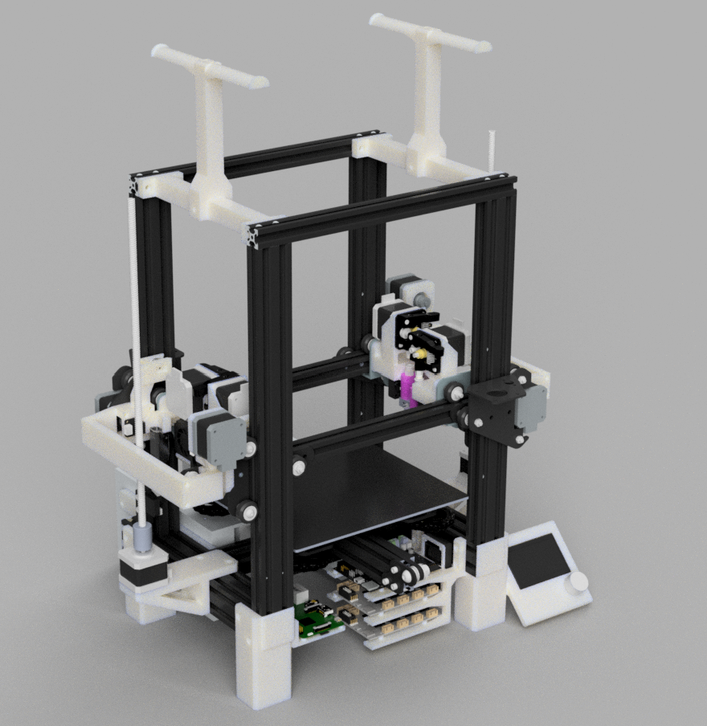
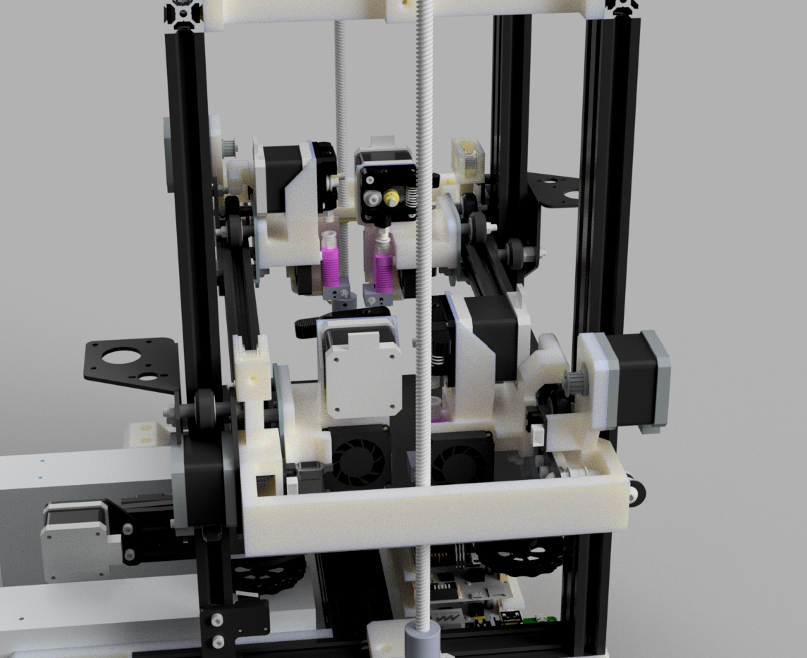
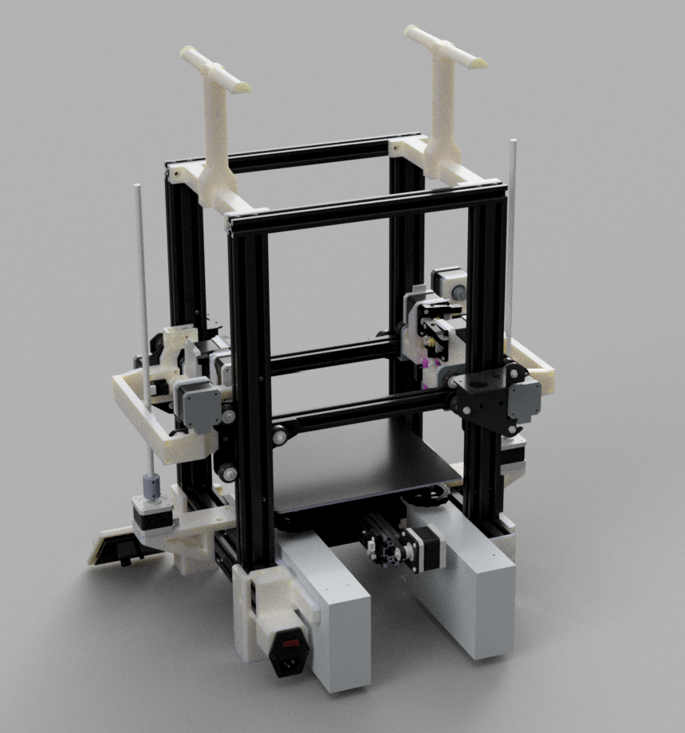
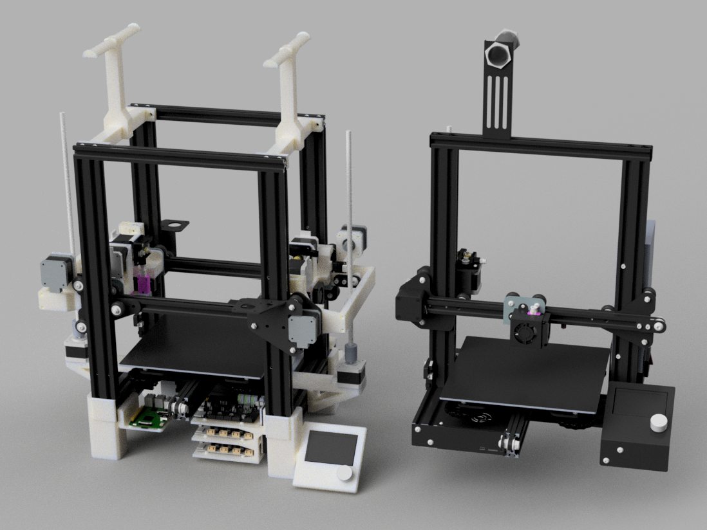

# Ender X4

A low cost, quad extruder 3D printer based on the Ender 3. It uses an IDEX design, but with two X axis gantries in order to enable the use of four toolheads. 

## Features

- Total cost is about $400 USD
- Most parts are reused from two original Ender 3 printers
- Build volume of about 200mm x 200mm x 200mm
- Retains the Ender 3's Y axis design
- Direct drive extruders
- Dual Z axis motors
- SKR Mini E3 v2 + 2x Creality 4.2.7 for mainboards
- Raspberry Pi used for Klipper
- Optional CR Touch support

## Images

