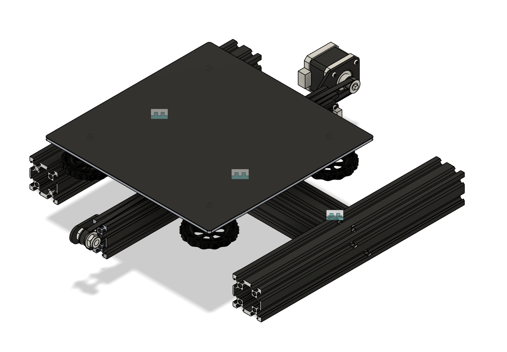
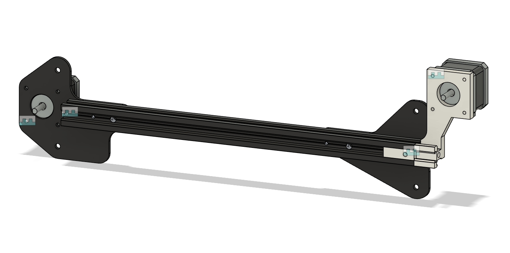
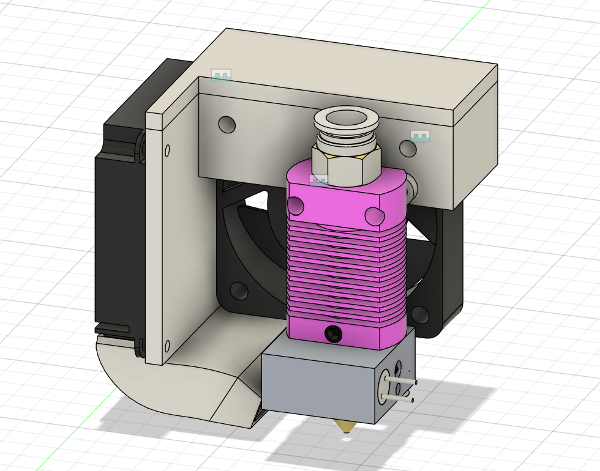
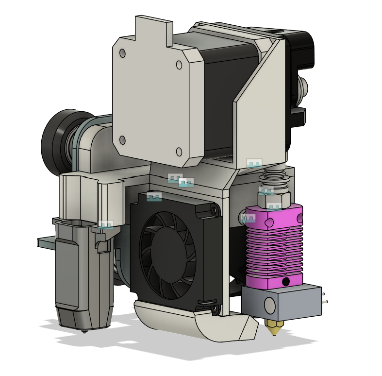
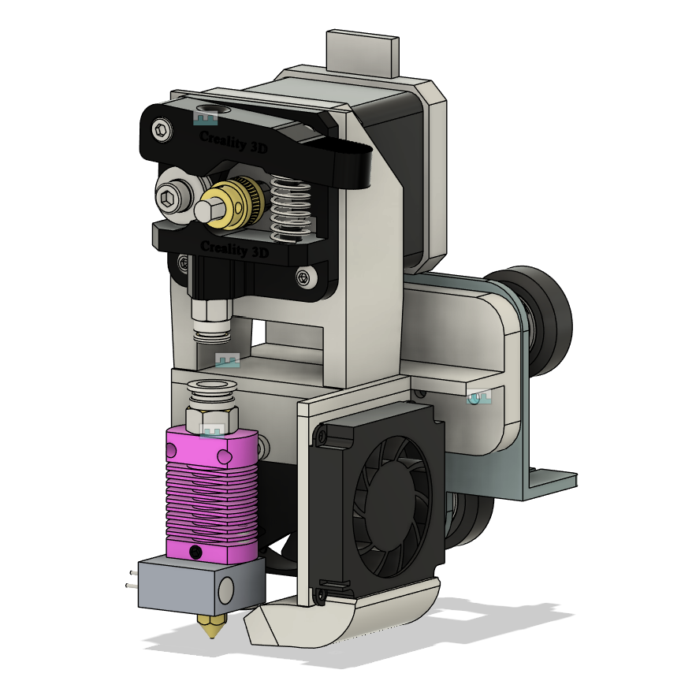
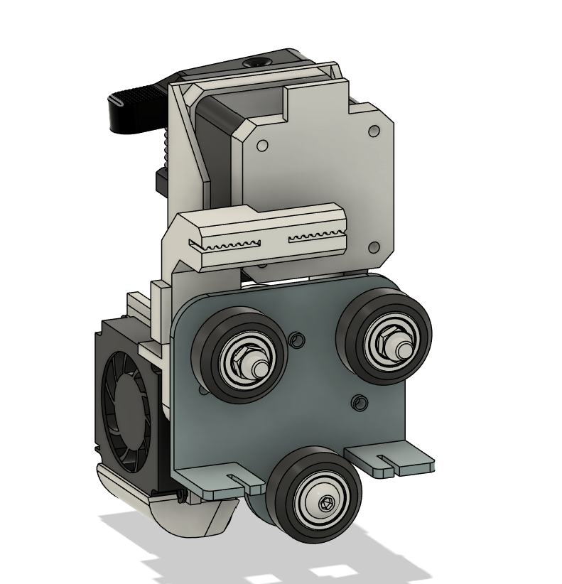
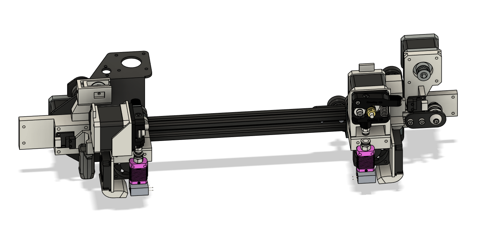
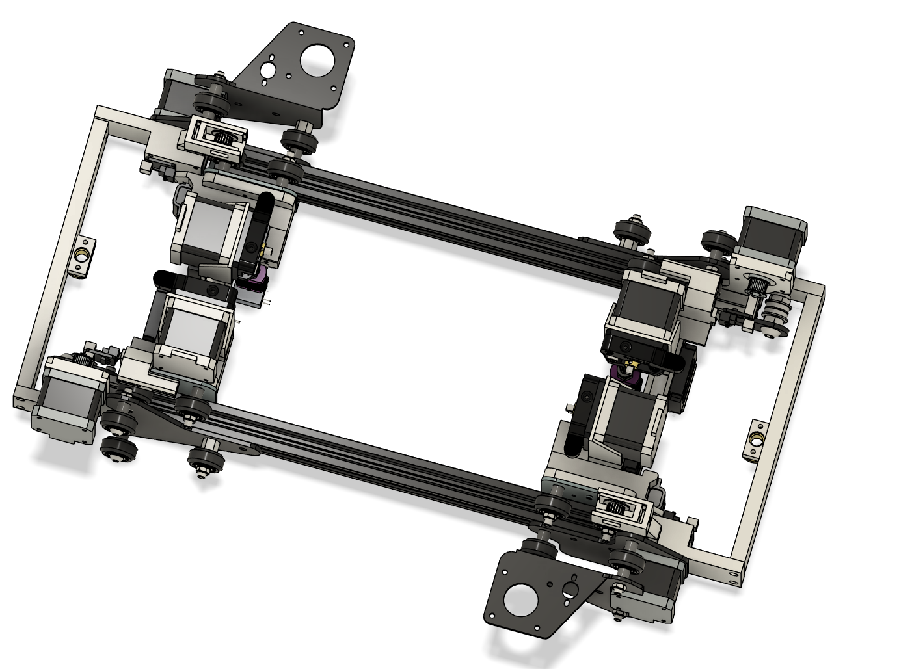
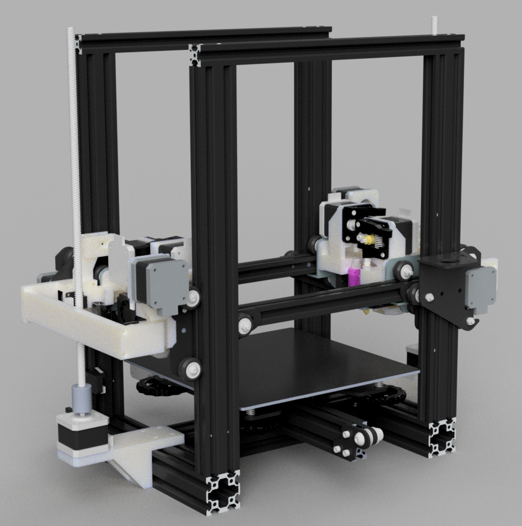

Made by: ading2210 // vk6
Repository link: https://github.com/ading2210/infill-printer
Total hours so far: 25

- [x] I have a 3D printer or will be getting one before March 21st

## 3/13/25 - Research design goals and feasibility (2.5 hrs)

I did these notes on a Google Doc originally, so here it is copy-pasted:

**Goals:**

* Reuse as many parts as possible from 2 stock Ender 3 printers   
* Quad extruder with independent hotends (IDEX or single toolhead?)  
* Under $250, used parts allowed  
* Entirely off the shelf components and printed parts  
* Maximize build volume 

**IDEX Design**

* Need 4 x axis motors and 4 belts  
* Total motor count – 4 x axis, 1 y axis, 4 extruder, 2 z axis (total: 11).   
  * 1 extra motor (Nema 17\) needed for x axis ($10)  
* Control boards (option 1):  
  * Main: BTT Octopus ($80)  
    * Used for x, y, z axis and bed heater  
  * Extra: 2x stock Creality v1.1.4 (or v4.2.7)  
    * Used for all 4 extruders, 4 hotend heaters  
* Control boards (option 2):  
  * Main: BTT SKR v1.4 ($30) \+ 5x TMC2209 ($20)  
    * Used for x, y axis and bed heater  
  * Extra: 2x stock Creality v1.1.4 (or v4.2.7)  
    * Used for all 4 extruders, z axis, 4 hotend heaters  
* Control boards (option 3):  
  * Main: BTT SKR Mini E3 v2 ($35)  
    * Used for x axis and bed heater  
  * Extra: 2x stock Creality v4.2.7   
    * Used for all 4 extruders, z axis y, axis, 4 hotend heaters  
* Extra cost: $35-$90

**Single Carriage Design**

* Only 1 x axis motor and belt  
* Total motor count – 1 x axis, 1 y axis, 4 extruder, 2 z axis (total: 7\)  
* Control boards:  
  * Main: BTT SKR Mini E3 v2 ($35)  
    * Used for x, y, z axis and bed heater  
  * Extra: 2x stock Creality v1.1.4  
    * Used for all 4 extruders, 4 hotend heaters  
* Extra cost: $35

**Attributes Common to Both Designs:**

* Ender 3 v2 Neo might be used instead because those are cheap on ebay  
  * Otherwise use the Ender v3 v1 because that one is open source  
* 2 power supplies (stock ones used)  
* 2 of the hotends and extruders need to be purchased  
  * [Creality Direct Drive Kit](https://www.amazon.com/Creality-Original-Extruder-Flexible-Filament/dp/B09NVWJYMT) x2 ($60)  
* Purchase 2 Ender 3 v1s used ($100 \- $120)  
* Main computer is Raspberry Pi 3 with Klipper  
* Dual X axis gantry, dual z axis motors  
* Keep a belt slinger design   
* Use stock rollers for x axis (linear rails if within budget)  
* Keep stock hotend   
* Keep stock motors  
* Direct drive

## 4/1/25 - Frame, Y Axis (1.5 hrs)

I'm going to re-use the Ender 3 Y axis carriage and use the same design for the bottom portion of the printer's frame. I don't see a way I can improve the Y gantry without excessively modifying the parts, because the aluminum extrusions are already machined with slots for the Y axis gantry. Also, the various Ender 3 variants use slightly different Y axis gantries (this is pretty much the only mechanical change between the different Ender 3s) so making a single design to accommodate all of them is unrealistic. 

## 4/2/25 - Frame, Start X Axis (1 hr)

- Assemble the Y Axis and attach it to the frame
- Start assembling the X gantry

 

## 4/4/25 - Continue X Axis (2 hrs)

- Create mount for second X motor
- Add motors to X axis assembly

 

## 4/6/25 - Create A/B Toolheads (10 hrs)

In my design, there are two different toolhead designs. The "A" toolhead is on the left side of the X gantry, and the "B" toolhead is on the right. The hotend assembly is mirrored on the B toolhead, but the extruder mount has to be different. The goal for the hotend assembly is to get the hotend as close to the center of the printer as possible. This allows the hotend on each toolhead to come close to each other while printing, thus maximizing the printable area.

Creating the hotend assembly was a bit annoying because of the unconventional layout. I need the hotend fan to be *behind* the hotend rather than in front of it, so the hotend can't be directly mounted to the X carriage base. The fan duct for the part cooling fan was also a pain, but I'm going to blame that on my inexperience in modeling this kind of part in Fusion. 

 

Following the hotend assembly, I moved on to building both toolheads. This was relatively simple, since I just had to attach the hotend assembly to the extruder and X carriage base. I also added a mount for a CR Touch probe on the A toolhead.

 
 

## 4/7/25 - Finish X and Z Axis (10 hrs)

First, I needed to modify my B toolhead design to add in a belt holder. This is because the belt for this toolhead will be placed well above aluminum extrusion rather than around it like the stock toolhead does. This was a simple addition, and I used a model of a GT2 belt as a reference so I could make a cut of the belt profile.

 

I then finished one half of the X axis gantry, which contains both A and B toolheads on the same axis. The new additions here are the endstop mounts, belt tensioner, and the brackets on either side for the joining pieces to the other half of the X gantry.

 

To create the full X axis gantry, I copied the part shown above and rotated it 180 degrees. I added connecting pieces between the two halves, and attached the Z nuts to them. 

 

In the full printer assembly, I added the extrusions for the Z axis as well as the X gantry. I made a mount for the Z motors, lead screws, and Z endstop.

 
